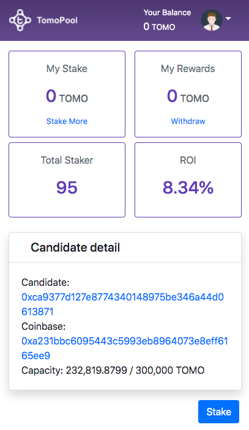
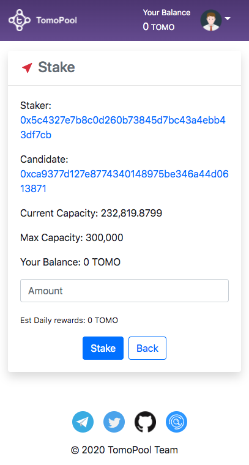

# TomoPool client website
TomoPool is a staking service running on TomoChain, built with VueJS.
TomoPool allows you to stake your TOMO coin and you will receive the rewards
## Requirement
[NodeJs](https://nodejs.org)
## Setup
```
npm install
cp .env.example .env
```
edit environment on `.env` file
```
VUE_APP_CANDIDATE_ADDRESS= 
VUE_APP_TELEGRAM=https://t.me/tomopool
VUE_APP_TWITTER=https://twitter.com/tomopoolann
VUE_APP_NAVBAR_IMAGE=tomopool.png
VUE_APP_POOL_NAME=TomoPool
```
`VUE_APP_CANDIDATE_ADDRESS` is smart contract you deployed on TomoChain mainnet

`VUE_APP_TELEGRAM` is your telegram channel

`VUE_APP_TWITTER` is your twitter

They will be use for website (bottom icon)


`VUE_APP_NAVBAR_IMAGE` if you dont have new logo. Please use default logo


## Compiles and hot-reloads for development
```
npm run serve
```


## Compiles and minifies for production
```
npm run build
```

 
